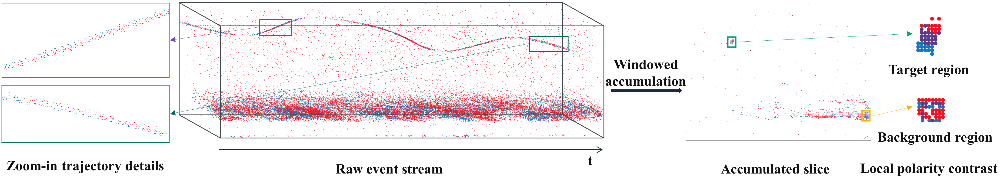
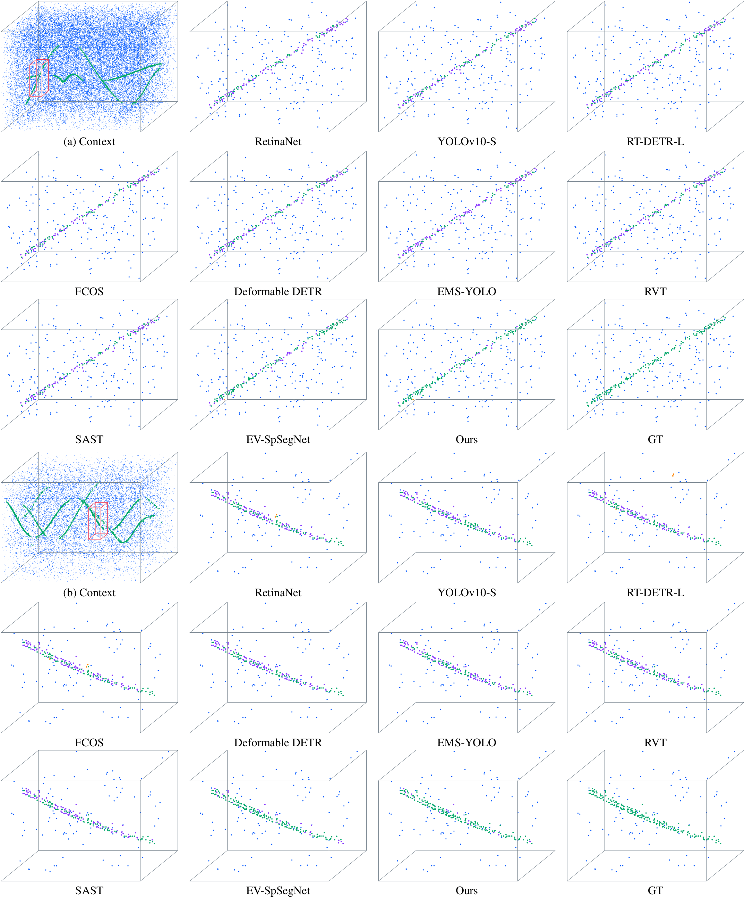

<h1>PGST-Det: Polarity-Guided Sparse Trajectory Learning for Event-Based Tiny Flying Object Detection</h1>

Xiucheng Wang1, Xinjun Li2, Hongguang Li1,&#8224;, Wenge Fan2

1Institute of Unmanned Systems, Beihang University 
2School of Mechanical Engineering and Automation, Beihang University

(&#8224; corresponding author)

Manuscript in preparation for <i>IEEE Transactions on Instrumentation and Measurement</i>

## 📖 Abstract

Reliable detection of tiny flying objects from event-camera measurements is challenging because a target may generate only a few asynchronous events amid background motion, illumination-induced activity, and sensor noise. To address this problem, we propose **PGST-Det**, an event-level framework that estimates target-event support directly from sparse spatio-temporal event measurements. PGST-Det first enriches occupied voxels with density, polarity-composition, and temporal-distribution statistics and then organizes fragmented target trajectories through a sparse encoder-decoder with multiscale dilated convolutions and polarity-informed branch gating. A polarity-aware spatio-temporal correlation (**PSTC**) objective further couples geometric support with polarity-consistent and local polarity-composition cues to provide structured event-level supervision. In addition, Target-Preserving Zoom (**TPZ**) introduces label-conditioned crop-and-zoom augmentation while preventing sparse target evidence from being removed. Experiments on EV-UAV show that PGST-Det improves mean event-level intersection over union by **10.96 percentage points** and yields a lower false-alarm rate in each of three matched training repetitions. Evaluation on EV-Flying Bird/Insect, together with synthetic background-event-noise tests, further examines applicability beyond UAV targets and robustness to noisy event measurements, with only a small incremental sequence-level inference cost.

## 🧠 Method

PGST-Det operates directly on sparse asynchronous measurements and returns an event-wise target probability. Training-time augmentation and supervision are removed during inference.

| Component | Description |
|---|---|
| **PTVE** | Enriches occupied voxels with event density, polarity composition, and temporal-distribution statistics. |
| **PGST-Net** | Organizes fragmented trajectories through multiscale sparse convolutions and polarity-informed branch gating. |
| **PSTC** | Couples local geometric support with polarity-consistent and polarity-composition cues for event-level supervision. |
| **TPZ** | Applies label-conditioned crop-and-zoom augmentation while preserving scarce target-event evidence. |

## 📊 Results

The values below follow the current manuscript protocol. **ACC** follows the EV-UAV benchmark notation and measures target-event recall rather than background-dominated global accuracy. Lower **Fa** is better.

### EV-UAV

EV-SpSegNet and PGST-Det are reported as matched three-run means.

| Method | IoU (%) ↑ | ACC (%) ↑ | Pd (%) ↑ | Fa (10-4) ↓ |
|---|---:|---:|---:|---:|
| EV-SpSegNet | 53.41 | **70.87** | **82.84** | 13.531 |
| **PGST-Det** | **64.37** | 69.12 | 78.00 | **0.646** |

PGST-Det improves mean IoU by **10.96 percentage points** and lowers Fa in every matched repetition. The result reflects a more selective target-background estimate rather than an unconditional increase in target recall.

### EV-Flying Bird/Insect

The source-sequence-disjoint evaluation includes frozen-weight transfer from EV-UAV and dataset-specific adaptation. Frozen transfer uses target-validation operating-point calibration and is not presented as strict zero-shot deployment.

| Setting | Method | IoU (%) ↑ | ACC (%) ↑ | Pd (%) ↑ | Fa (10-4) ↓ |
|---|---|---:|---:|---:|---:|
| Frozen transfer | EV-SpSegNet | 17.31 | 46.08 | **23.43** | 134.784 |
| Frozen transfer | **PGST-Det** | **30.67** | **58.03** | 18.98 | **58.745** |
| Dataset-specific adaptation | EV-SpSegNet | 70.14 | **95.01** | **67.64** | 14.078 |
| Dataset-specific adaptation | **PGST-Det** | **71.77** | 94.85 | 64.25 | **13.656** |

Under frozen-weight transfer, PGST-Det improves IoU by **13.36 percentage points** and reduces Fa by **56.4%** relative to EV-SpSegNet.

### Qualitative Comparison

The EV-UAV examples below contain cluttered and sparse tiny-target trajectories. PGST-Det retains the dominant target support while removing a larger portion of isolated background responses.

  

## 🔧 Usage

The repository currently serves as the official project page. The reproducible implementation will be published here upon acceptance and will include:

- [ ] Source code for PGST-Det
- [ ] Environment and dependency specification
- [ ] Training and evaluation configurations
- [ ] Pretrained checkpoints
- [ ] Dataset preparation utilities
- [ ] Scripts for reproducing the principal tables and figures

Commands in this section will be added together with the implementation so that the documented interface matches the released code.

## 🎨 Preparing Datasets

### EV-UAV

[EV-UAV](https://arxiv.org/abs/2506.23575) is the primary benchmark. It contains 147 sequences with event-level binary annotations and predefined 99/24/24 training, validation, and test splits. The release will include preprocessing and evaluation instructions without redistributing the dataset itself.

### EV-Flying Bird/Insect

[EV-Flying](https://doi.org/10.1109/CVPRW67362.2025.00487) provides temporally indexed bounding boxes for in-the-wild flying objects. Our protocol derives event-level labels from the bird/insect boxes and uses source-sequence-disjoint training, validation, and test subsets. The exact split manifest and conversion utility will accompany the code release.

## 💻 Training

The release will provide the complete configurations used for the matched EV-UAV repetitions and EV-Flying experiments. Configuration files will record optimization, augmentation, checkpoint selection, and validation-threshold selection settings.

Training commands will be documented after the implementation is public.

## ✨ Evaluation

The evaluation package will report event-level IoU, benchmark ACC, Pd, and Fa under the protocols described in the manuscript. It will also include the low-false-alarm threshold sweep, synthetic-noise evaluation, and sequence-level efficiency measurement.

Evaluation commands and expected output files will be documented with the release.

## 🎫 License

A source-code license will be added when the implementation is released. At present, this repository contains project documentation and representative paper figures only.

## ⭐ BibTeX

The canonical BibTeX entry will be added when a public preprint or IEEE paper record becomes available.

## 📧 Contact

For project-related questions, please open a GitHub issue. Implementation-specific support will begin with the code release.

## 🙏 Acknowledgements

This work builds on the event-level tiny-object detection setting and EV-SpSegNet baseline introduced with EV-UAV. We thank the authors of EV-UAV and EV-Flying for making their research resources available to the community.
