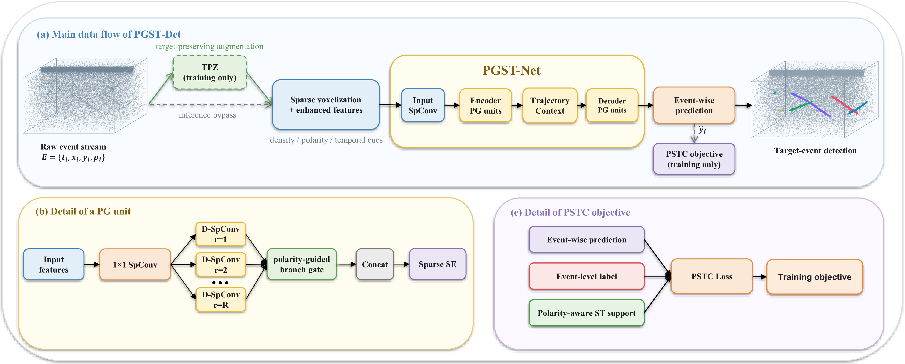

# PGST-Det

**Polarity-Guided Sparse Trajectory Learning for Event-Based Tiny Flying Object Detection**

Event-level tiny flying object detection directly from sparse asynchronous measurements.

## Overview

PGST-Det estimates target-event support directly from sparse event-camera measurements. It is designed for tiny flying objects whose evidence may consist of only a fragmented trajectory embedded in background motion, illumination-induced activity, and sensor noise.

The framework combines polarity-temporal voxel encoding, polarity-guided sparse trajectory processing, a polarity-aware spatio-temporal correlation objective, and target-preserving augmentation. Its main goal is to improve target-background overlap while suppressing clutter-induced false alarms.

> **Release status:** This public repository currently hosts the project summary and representative results. The complete source code, configurations, pretrained checkpoints, and reproduction scripts will be released here upon acceptance of the manuscript.

## Motivation

Tiny targets form sparse trajectories in the raw event stream. Temporal accumulation can dilute this evidence, while local ON/OFF polarity organization provides a complementary cue for separating target support from clutter.

  

## Method

  

| Component | Role |
|---|---|
| **PTVE** | Enriches occupied voxels with density, polarity-composition, and temporal-distribution statistics. |
| **PGST-Net** | Organizes fragmented trajectories using multiscale sparse convolutions and polarity-informed branch gating. |
| **PSTC** | Couples local geometric support with polarity-consistent and polarity-composition cues for event-level supervision. |
| **TPZ** | Applies label-conditioned crop-and-zoom augmentation while preserving scarce target evidence. |

## Main Results

The tables below summarize the current manuscript results for the direct event-level comparison. EV-UAV values are matched three-run means. EV-Flying Bird/Insect evaluates frozen-weight transfer from EV-UAV with target-validation operating-point calibration.

### EV-UAV

| Method | IoU (%) &uarr; | ACC (%) &uarr; | Pd (%) &uarr; | Fa (10-4) &darr; |
|---|---:|---:|---:|---:|
| EV-SpSegNet | 53.41 | **70.87** | **82.84** | 13.531 |
| **PGST-Det** | **64.37** | 69.12 | 78.00 | **0.646** |

PGST-Det improves mean event-level IoU by **10.96 percentage points** and produces a lower Fa in every matched training repetition. The result reflects a more selective operating balance rather than an unconditional increase in target recall.

### EV-Flying Bird/Insect

| Method | IoU (%) &uarr; | ACC (%) &uarr; | Pd (%) &uarr; | Fa (10-4) &darr; |
|---|---:|---:|---:|---:|
| EV-SpSegNet | 17.31 | 46.08 | **23.43** | 134.784 |
| **PGST-Det** | **30.67** | **58.03** | 18.98 | **58.745** |

Under frozen-weight transfer, PGST-Det improves IoU by **13.36 percentage points** and reduces Fa by **56.4%** relative to EV-SpSegNet. This setting evaluates cross-domain weight transfer with target-validation threshold calibration and is not presented as strict zero-shot deployment.

## Qualitative Comparison

Representative EV-UAV examples include cluttered and sparse tiny-target trajectories. PGST-Det retains the dominant target support while removing a larger portion of isolated background responses.

  

## Planned Release

- [x] Project page and method summary
- [x] Representative quantitative and qualitative results
- [ ] Source code for PGST-Det
- [ ] Training and evaluation configurations
- [ ] Pretrained checkpoints
- [ ] Dataset preparation instructions
- [ ] Scripts for reproducing the principal experiments

The implementation will be organized before release so that training, validation-threshold selection, evaluation, and figure reproduction follow the protocols described in the manuscript.

## Citation

Citation information will be added when a public paper record becomes available.

## Contact

For project-related questions, please open a GitHub issue. Implementation-specific support will begin with the code release.
